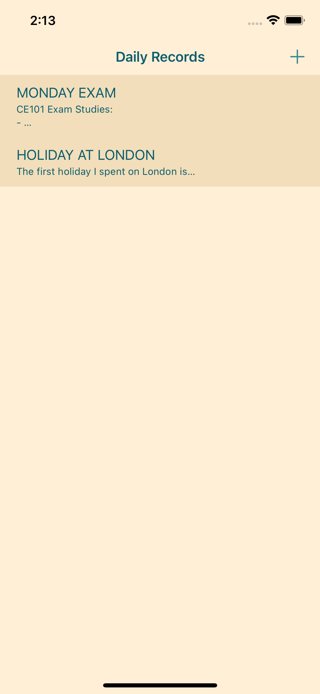

# Daily Records
> This is a simple diary application.

## General Information
- This application allows users to keep a simple diary.
- Newly written records are saved to the device and can be opened, updated, and deleted.
- The purpose of this application is to study Core Data.

## Technologies Used
- Core Data

## Features
- Creating new text records
- Updating and deleting existing records
- Displaying every record sorted based on the time they are created

## Secreenshots

## Setup
To open this project locally, clone the project and open it in Xcode.

## Usage
To create a category for different types of entries, go to the Core Data file 'DailyRecords,' create a new entity called 'Category' and set a new relationship with the existing entity 'Record.'

## Project Status
Project is _complete_.

## Acknowledgements
- This project is prepared for the [iOS & Swift - The Complete iOS App Development Bootcamp](https://www.udemy.com/course/ios-13-app-development-bootcamp/) course, but it is changed and modified to study a specific part of the lesson: Core Data.
